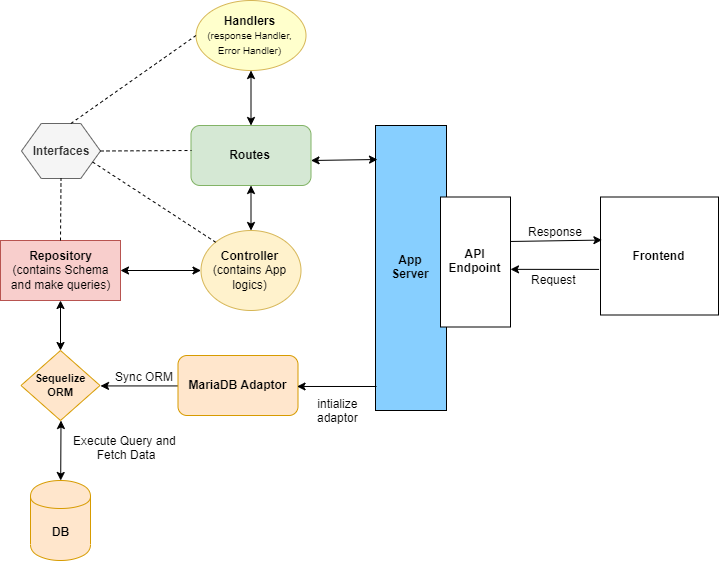
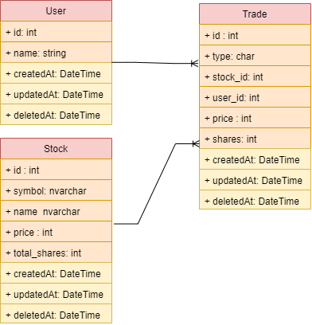

# About The Project

This is the Backend section of the trial project. It is developed using Nodejs/Fastify/TypeSctipt.

#### Prerequisites to running the API:

- Node.js
- Git
- PHPMyAdmin (MariaDB/MySQL2)
- NPM (optional)

## Available Scripts

First, you need to install the modules using `npm install` or `npm i`

Then, in the project directory, you can run:

### `npm run start:dev`

Runs the app in the development mode.\
Open [http://localhost:8080](http://localhost:8080) to view it in your browser.

The page will reload when you make changes.\
You may also see any lint errors in the console.

### `npm run build`

Builds the app for production to the `build` folder.\

Your app is ready to be deployed!

### `npm run start:prod`

Runs the app in the production mode.\
Open [http://localhost:8088](http://localhost:8088) to view it in your browser.

You need run the `npm run build` script first.
You may also see any lint errors in the console.

### `npm run test`

Launches the jest test cases wriiten in test folder.\
See the section about [running tests by ts-jest](https://github.com/kulshekhar/ts-jest) for more information.

## Learn More

### Architecture

Here is a brief diagram of this project Architecture.



### Class Diagram

In this project there are three main entities (User, Stock and Trade). The relations between these entities are describing as follow:

- A **_User_** has many or zero **_Stock_**
- A **_User_** has many or zero **_Trade_**
- A **_Trade_** has only one **_Stock_**



Expect entities to look something like this:

```typescript
type User = {
  id: number;
  name: string;
  createdAt: DateTime;
  updatedAt: DateTime;
};

type Stock = {
  id: number;
  name: string;
  symbol: string;
  price: string;
  total_shares: string;
  createdAt: DateTime;
  updatedAt: DateTime;
};

type Trade = {
  id: number;
  user_id: number;
  stock_id: number;
  type: string;
  shares: number;
  price: number;
  createdAt: DateTime;
  updatedAt: DateTime;
};
```

### API endpoints

There are four major endpoints that each contains the needed APIs:

Endpoints:

- `/erase`
- `/trades`
- `/stocks`
- `/users`

APIs:

- Delete all trades \
  `DELETE` `http://localhost:8088/erase` \

respose `StatusCode: 200`:

```json
{
  "success": {
    "code": 200,
    "message": "200 : trades was erased successfully"
  }
}
```

- Get all trades \
  `GET` `http://localhost:8088/trades` \
  respose `StatusCode: 200`:

```json
 [
    {
        "id": 3121427,
        "type": "sell",
        "symbol": "AEUA",
        "shares": 11,
        "price": 164.35,
        "timestamp": "2014-08-09 13:25:13",
        "user": {
            "id": 3977934,
            "name": "Laura"
        }
    },
    ...
]
```

- Create a new trade \
  `POST` `http://localhost:8088/trades` \
  request:

```json
{
  "id": 3121427,
  "type": "sell",
  "user": {
    "id": 3977934,
    "name": "Laura"
  },
  "symbol": "AEUA",
  "shares": 11,
  "price": 164.35,
  "timestamp": "2014-08-09 13:25:13"
}
```

response `StatusCode: 201`:

```json
{
  "success": {
    "code": 201,
    "message": "201 : Save data is successfully"
  }
}
```

response `StatusCode: 400`:

```json
{
  "error": {
    "code": 400,
    "message": "400 : Record already exists"
  }
}
```
